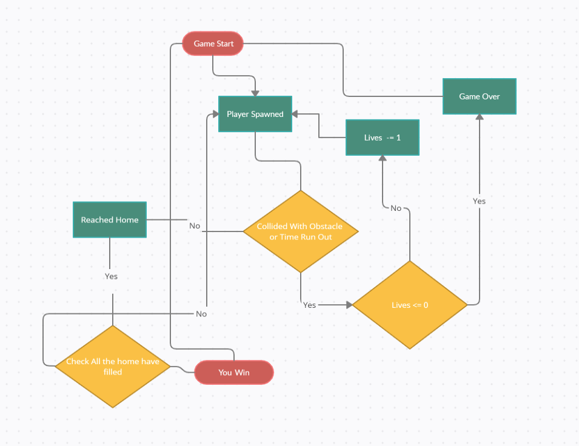

# Frogger-Game

#Project title

This project is just a reskin of Frogger-Game 1981. 

# Project Flow 

* Game Start with a countdown from 5. 
* Once the game starts the player is able to move the character in all four directions and the obstacles from both the game areas start to spawn within a given time interval and     move across the screen.
* Using the Arrow key player is able to control the character.
* Users need to reach the home without getting killed.
* The player will have 3 life each time the player dies lives get reduced by 1
* If lives get to 0 the game over. The player will again start the game from scratch.
* If a player reaches all the 5 homes then the player wins the game.

# Flow Diagram

# Project Structure

 # GameManager Class :- This Class is used to control the over all state of the game.
      # CheckGameOver()  This Function is used to check whether the game is over or not and reduce lives
      # SpawnHome()      This function used spawn the home if player reached using the argument
      # CheckWin()       This function is used to check the win condition
      # CountDown()      This function is used for Time CountDown
      # GameStart()      This Function used to Start the game by countdown
      # RestartGame()    Use to restart the Game
      
 # PlayerControl Class:-  The purpos of this PlayerControl Class is to control the player movement,animation and the collision detection between different obstacle.
      # Movement()           This Function used to move the character and play animation and hop sound
      # CheckPlayerInRiver() This function is creted to check whether the player is fell down in the water or move with the obstacle in the river part of the level portion
      # ResetPlayer()        This function used to reset the player properties
      # Die()                This function used to disable the player control
      
 # SpawnObject Class:- This class used to spawn the obstacle in the game and this class create is own object polling for the obstacle object and use it to spawn obstacle
      # SpawnMode This Enum is use to determain whether want to spawn single object or multiple object
      # SpawnObjectStruct This struct use to store the information about the Spawnobject and its poll list
      # CreatePoll() This function is used to create the poll for the object using spawnObjects data.
      # CreateObject() This function is used to create object and add to poll List.
      # GetObjectFromPoll()  This Function use to get the object from the poll list with the help of argument.
      # Spawn() This Funtion is used get the index based on the sapwnmode and trigger the sapwn function.
      # SpawnObjects() This function is used to spawn actual object with the help of index value which is passed as an argument
      
 # MoveObstacle Class:- This class is use to move the object in given Direction and To check whether the object left the game area if so disable the object
      # SetDir() This function is used to set the Direction and find the right value for that direction
      # Deactivate() This function is used to check whether the object left the game area and if so disable the object
 
 # Lives Class:- This Class is use to store the data related player Lives
      # ReduceLives() This Function is used to Reduce player lives by 1
      # IsDead() This function is used to check whether player is dead or not.
      
 # ScoreManager Class:- This class is used for store the current and high score of the game
      # UpdateScore() This function is used Update the score
      
 # DestroyObject Class:- This class only used for destroying the small corcodile
 
 # TurtleColliderDestroy Class:- This class is used to Deactivate and Activate the collider which attached to the Object 
      # DisableCollider() Use to Deactive the collider
      # EnabelCollider()  Use to Activating the collider
 
 # AudioManager Class:- This class is used to manage the audio of the game.
      # AUDIOTYPE  This enum used to identify the correct audio clip.
      # AudioClipData This struct is used store clip data with its enum
      # PlaySound() This function used play correct audio based on the argument passed

